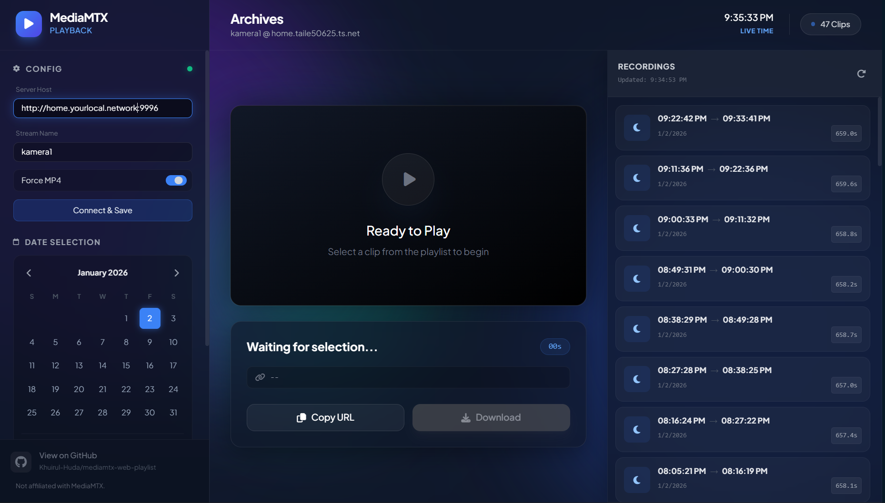

# MediaMTX Web Playlist

A lightweight single-file web UI for browsing and playing recorded clips from a MediaMTX (rtsp/rtmp/hls) server.

This repository contains a single `index.html` file that bundles the entire UI (HTML, CSS, and JavaScript) so it can be served directly from any static host or opened locally without a build step.

## Why a single-file
The app is intentionally provided as a single HTML file to keep things simple and portable:

- Easy to deploy: drop `index.html` on any static host (GitHub Pages, Netlify, S3, local file server).
- Zero build tooling: no npm, bundler, or compilation required.
- Portable: easy to copy between machines or embed inside other systems.

If you prefer a multi-file or build-based setup, consider extracting the JS/CSS into separate files and adding a packager.

## Quick Start
1. Serve the folder with a static server (recommended) or open `index.html` directly in modern browsers.

Example (Python):

```bash
python3 -m http.server 8000
```

Then open http://localhost:8000 in your browser.

## Configuration (in the UI)
- Server Host: base URL of your MediaMTX API (example: `http://localhost:9996`). Do not include a trailing slash.
- Stream Name: stream path/name as used by your MediaMTX instance (example: `cam1`).
- Force MP4: toggle whether the `/get` endpoint should return mp4 format.

After filling those fields, click `Connect & Save`. The app persists these values in `localStorage`.

## How to use
- Date selection: use the calendar or the manual `Start` / `End` datetime inputs. Click `Apply Filter` to fetch recordings for the selected range.
- Reset to Today: clicking "Reset to Today" sets the range to the current day and refreshes the recordings list.
- Playlist: click an item to play it in the embedded video player. Use `Copy URL` to copy the direct stream URL or `Download` to attempt a direct download.

## API endpoints used by the UI
This UI expects the following endpoints on the configured host:

- `GET /list?path=<path>&start=<ISO>&end=<ISO>`
  - Returns a JSON array of recordings. Each item should include `start` (ISO timestamp) and `duration` (seconds). Example:
    ```json
    [ { "start": "2024-01-01T12:00:00Z", "duration": "12.3" } ]
    ```
  - A `404` response is treated as "no recordings".

- `GET /get?path=<path>&start=<ISO>&duration=<seconds>&format=mp4` (optional format)
  - Returns the raw media stream (mp4 or chunked). The UI uses this URL to play or download.

If your MediaMTX instance uses different endpoints, adapt the host or provide a small proxy that matches the expected routes.

> NOTE: This UI's playback/list endpoints follow the MediaMTX playback documentation at https://mediamtx.org/docs/usage/playback. If that upstream documentation or the endpoints change, please open an issue in this repository so the UI can be updated accordingly.

## Troubleshooting
- Empty list / Connection failed: check the Host URL, Stream Name, and browser console for CORS errors.
- If recordings are not found, verify your MediaMTX server's `/list` response and time ranges.
- The `Download` feature streams the resource via the browser; large downloads may fail depending on server headers or chunking.

## Important notes

- This project is a full client-side application (everything runs in the browser). However, it still requires internet access to load third-party libraries and fonts used by the single-file bundle (Tailwind CDN, Font Awesome, Google Fonts). If you need fully offline operation, extract the assets and host them locally or build a self-contained release.

- PROTOCOL MATCHING IS CRITICAL: the web page and the MediaMTX endpoints must use the same protocol (both HTTPS or both HTTP). Modern browsers block mixed content — a page served over HTTPS will NOT fetch resources from an HTTP API. If you serve this UI via HTTPS, make sure your `Server Host` uses `https://` so the browser can contact the MediaMTX endpoints successfully.

- DATA PERSISTENCE: this app stores user configuration (Server Host, Stream Name, Force MP4) in the browser's `localStorage`. These values persist on the user's machine and are not transmitted to any third-party by the app itself. Clear your browser storage to reset saved settings.

- REQUESTS & PROCESSING: all network requests (the `/list` and `/get` calls) are performed directly by the browser (via `fetch`). All UI logic and processing run client-side in the browser—there is no server-side component in this project. Because of this, CORS, browser security, and protocol mismatches (HTTP vs HTTPS) directly affect functionality.

## Notice
This  not affiliated with the official MediaMTX project.

## Contributing
Feel free to open issues or PRs on the repository: https://github.com/Khuirul-Huda/mediamtx-web-playlist

## License
See repository for license information.

## Screenshots
